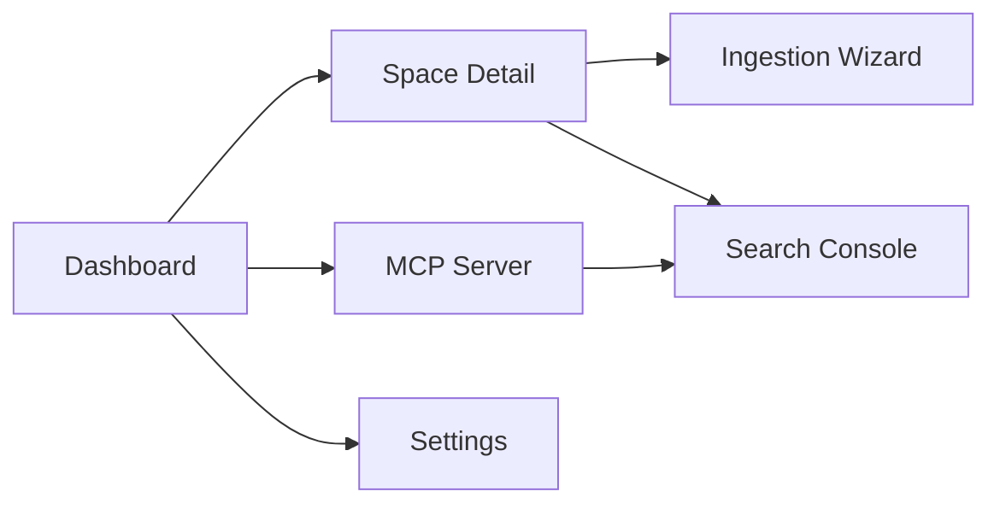

# UI Design Specification: Local RAG Developer Tool

## 1. Purpose
This document translates the product requirements in `10_local_rag_prd.md` into a user interface design for a local-first control plane. The UI is intended to help developers and team maintainers create Spaces, ingest documents, validate retrieval quality, and operate the MCP server without leaving their local machine.

## 2. UX Goals
- Make local-only behavior obvious so users trust that documents and queries do not leave the machine.
- Keep the main workflows fast: create a Space, ingest PDFs, test retrieval, and enable MCP access.
- Support incremental growth of a Space by allowing users to add more PDFs over time without rebuilding from zero.
- Preserve Space isolation so users can clearly see what corpus they are working with.
- Expose technical details only when needed, while keeping defaults safe for most developers.
- Show retrieval evidence, chunk provenance, and model compatibility to support debugging.

## 3. Primary Users
| User | Goals | Main Screens |
| --- | --- | --- |
| Individual developer | Search local standards, papers, and code docs from the IDE | Space Detail, Search Console, MCP Status |
| Space maintainer | Create and ingest a reusable Space for a team | Dashboard, Create Space, Ingestion Run |
| Team lead or platform engineer | Validate portability, metadata, and model compatibility across machines | Space Detail, Settings, MCP Status |

## 4. Product Surface
The UI design assumes a local admin console available in a browser or desktop shell, plus the downstream IDE chat experience that consumes the MCP server.

### 4.1 Local Admin Console Navigation
- Dashboard
- Spaces
- Ingestion Runs
- MCP Server
- Settings

### 4.2 IDE Consumption Surface
- GitHub Copilot Chat or Claude Desktop selects MCP-exposed tools.
- The UI does not replace chat. It configures and validates the data that chat will use.

## 5. Information Architecture

## 6. Core User Journeys

### 6.1 Create a New Space
1. User opens Dashboard.
2. User clicks `Create Space`.
3. User enters Space name, description, storage path, embedding model, and chunking profile.
4. System validates the name, target folder, and model availability.
5. System creates the Space folder with `metadata.json` and the vector store directory.
6. User lands on the new Space Detail page with an empty-state prompt to ingest files.

### 6.2 Add Documents to a Space (initial or incremental)
1. User opens a Space (new or existing) from the Dashboard or Spaces list and clicks `Add Documents`.
2. System detects whether this is the first ingestion or an append and displays the current corpus totals and mode (Create / Append).
3. User uploads or selects one or more local PDFs.
4. System performs duplicate detection against the Space manifest, shows warnings for previously ingested files, and provides a dry-run summary: file count, pages, expected model, target chunking strategy, and projected additions.
5. User confirms the operation and starts the run.
6. System shows live progress, warnings, and chunk counts.
7. System presents a completion summary with added/skipped counts, updated corpus totals, ingestion history entry, and a link to test retrieval.

### 6.3 Validate Retrieval Before Sharing
1. User opens Search Console inside a Space.
2. User enters a semantic or exact-match query.
3. System returns ranked chunks with score type indicators: vector, BM25, or hybrid.
4. User expands a result to inspect source page, chunk structure, table rendering, and image references.
5. User marks the Space as ready for sharing after spot-checking quality.

### 6.4 Operate the MCP Server
1. User opens MCP Server screen.
2. User starts the local server or verifies it is already running.
3. System shows discovered Spaces and generated MCP tools.
4. User copies the client connection configuration for VS Code or Claude Desktop.
5. User runs a test request to confirm end-to-end connectivity.

## 7. Screen Specifications

### 7.1 Dashboard
**Goal:** Give a fast overview of all Spaces and system health.

**Key Inputs**
- `Create Space` button
- Search box for filtering Spaces
- Status filters: Ready, Empty, Ingesting, Error, Model Missing

**Key Outputs**
- Space cards with description, chunk count, model, last updated time, and health badge
- Summary tiles: total Spaces, total chunks, active ingestion runs, MCP server status
- Empty state prompting the first Space creation

**Layout**
- Top bar with app name and privacy badge: `Local Only`
- Left navigation rail
- Main content area with summary row and grid/list switcher for Spaces

### 7.2 Create Space Modal
**Goal:** Collect the minimum information needed to initialize a portable Space.

**Inputs**
- Space name text box
- Description multi-line text box
- Storage location picker
- Embedding model drop-down
- Chunking strategy drop-down
- Optional toggles: enable image extraction, enable OCR, prebuild BM25 index

**Validation Rules**
- Space name must be unique within the root folder.
- Description is required and limited to a short summary.
- Embedding model selection must map to an installed local model or show a missing-model warning.
- Chunking strategy must be selected from supported profiles.

**Outputs**
- Inline validation errors
- Success toast with the created Space path
- Direct action buttons: `Open Space`, `Add Documents`

### 7.3 Space Detail Page
**Goal:** Act as the command center for one Space.

**Sections**
- Header with Space name, description, shareability badge, and status badge
- Metadata panel with model version, chunking profile, created timestamp, last updated timestamp, and storage path
- Corpus panel with document count, chunk count, image count, and table count
- Source manifest and ingestion history with file names, timestamps, and run outcomes (including incremental updates)
- Actions row: `Add Documents`, `Test Search`, `Open Folder`, `Export Metadata`
- Activity feed with recent ingestion runs, incremental updates, and retrieval tests

**Outputs**
- Clear readiness status for cross-machine portability
- Warning banners if the required embedding model is missing on the current machine

### 7.4 Ingestion Wizard
**Goal:** Guide the user through document processing with explicit operational choices.

The wizard supports both first-time ingestion and append mode for an existing Space.

**Step 1: Select Files**
- File picker
- Drag-and-drop upload zone
- File list with size, page estimate, and duplicate detection

**Step 2: Configure Parsing**
- Parser selection fixed to Docling, shown as read-only default
- OCR toggle
- Image extraction toggle
- Table preservation mode drop-down: Markdown, HTML, Auto

**Step 3: Configure Chunking**
- Chunking profile drop-down
- Preview panel showing how a sample section or table would be chunked
- Toggle for table summary embeddings

**Step 4: Review and Run**
- Target Space summary
- Mode indicator: `Create Space Corpus` or `Append to Existing Space`
- Current corpus totals and projected additions
- Estimated chunk volume
- Model compatibility check
- Start button

**Run-Time Outputs**
- Progress bar by file and total run
- Log stream with phase labels: parse, extract, chunk, embed, index
- Warning panel for skipped pages, OCR issues, or malformed tables
- Duplicate-file warnings or skip notices when applicable
- Completion state with added document counts, skipped duplicates, updated corpus totals, and next actions

### 7.5 Search Console
**Goal:** Let users verify retrieval quality before relying on IDE chat.

**Inputs**
- Query text box
- Search mode selector: Hybrid, Vector, Keyword
- Result count selector
- Filters for source document, page range, chunk type, and date

**Outputs**
- Ranked result list with chunk preview and relevance score
- Match-type tags: `Hybrid`, `Vector`, `BM25`
- Metadata drawer showing source file, page number, chunk path, and model used
- Rendered table preview when the result contains tabular content
- Local image thumbnail if the chunk references a figure

**Special Behavior**
- Queries containing IDs, numbers, or hyphenated codes show a note that BM25 weighting is increased.
- A `Compare Modes` toggle can display Hybrid versus pure Vector side-by-side for debugging.

### 7.6 MCP Server Screen
**Goal:** Expose runtime health and IDE integration status.

**Inputs**
- `Start Server` and `Stop Server` buttons
- Port field
- Auto-start toggle
- `Refresh Space Discovery` button

**Outputs**
- Server status indicator
- Tool list generated from available Spaces
- Client configuration snippets for VS Code and Claude Desktop
- Request log showing tool calls, latency, and error messages

### 7.7 Settings and Models
**Goal:** Manage local dependencies and defaults.

**Inputs**
- Knowledge base root folder
- Default embedding provider selector
- Model install actions
- Concurrency and resource usage settings

**Outputs**
- Installed model list with version and dimension info
- Warning state when a Space references a missing model
- Offline readiness checklist

## 8. UI Components
| Component | Behavior | Notes |
| --- | --- | --- |
| Space card | Shows status, counts, and quick actions | Must surface portability and model compatibility at a glance |
| Status badge | Encodes Ready, Ingesting, Warning, Error | Use icon + text, not color alone |
| Metadata drawer | Expands structured technical details | Supports copy-to-clipboard for paths and IDs |
| Query results panel | Lists ranked chunks | Supports citation-style navigation back to source assets |
| Progress log | Streams ingestion phases | Filterable by warnings and errors |

## 9. States and Feedback
### 9.1 Empty States
- No Spaces yet
- Space exists but has no documents
- MCP server has no discoverable Spaces

### 9.2 Success States
- Space created successfully
- Ingestion completed successfully
- MCP tool registration validated
- Search returned results with citations

### 9.3 Error States
- Missing embedding model
- Vector dimension mismatch
- Ingestion parser failure
- Unreadable PDF or OCR dependency unavailable
- Port conflict when starting the MCP server

### 9.4 Loading States
- Space discovery in progress
- Embedding model download in progress
- Ingestion run active
- Retrieval request running

## 10. Accessibility and Responsiveness
- All critical actions must be keyboard accessible.
- Status cannot rely on color alone.
- Tables in search results must support horizontal scrolling on narrow screens.
- The primary admin console should remain usable on laptop-width screens, with the dashboard collapsing to a single-column layout under tablet widths.

## 11. Suggested Visual Direction
- Use a technical, local-tooling aesthetic rather than consumer SaaS styling.
- Emphasize trust signals: local execution badge, file paths, model provenance, and source citations.
- Keep dense operational details available in drawers and expandable panels instead of hiding them behind separate pages.

## 12. Acceptance Criteria for UI Design
- A user can create, inspect, and manage isolated Spaces without ambiguity.
- A user can start an ingestion run and understand its progress and failure points.
- A user can validate hybrid retrieval quality before using the IDE client.
- A user can confirm whether the MCP server is healthy and which tools it is exposing.
