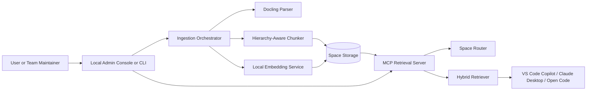
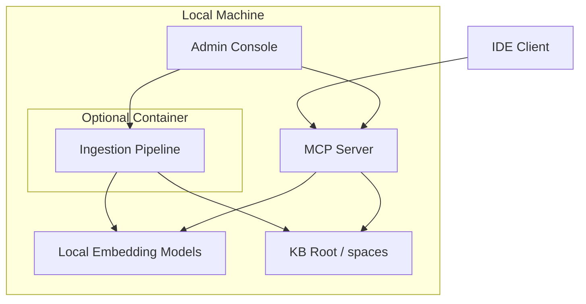
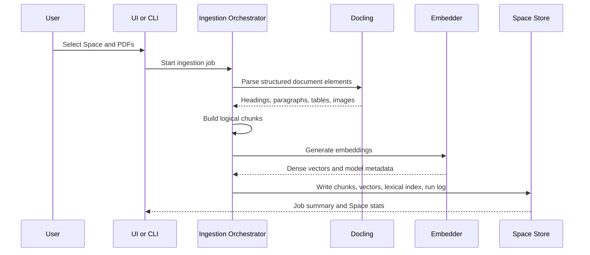
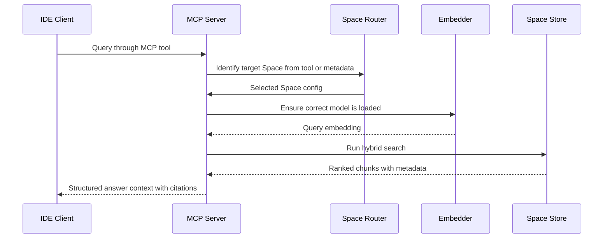

# Technical Architecture Design: Local RAG Developer Tool

## 1. Objective
This document converts the PRD into an implementable technical architecture for a local, privacy-first RAG platform. The system has two primary operating surfaces:
- a document ingestion pipeline for creating portable Spaces
- a retrieval service that exposes those Spaces through MCP to IDE clients

## 2. Architectural Principles
- Local-first execution with no document or query egress.
- Portable Space artifacts that can move across machines without re-ingestion.
- Incremental Space updates should append new content safely without requiring full Space recreation.
- Fast retrieval using hybrid search and lightweight metadata routing.
- Strict compatibility between stored vectors and embedding models.
- Clear separation between ingestion-time processing and retrieval-time serving.
- Simple and predictable operational model under concurrent ingestion and retrieval.

## 3. High-Level Architecture


## 4. Major Components

### 4.1 Local Admin Console or CLI
**Responsibilities**
- Create and manage Spaces
- Launch ingestion runs
- Inspect metadata and retrieval quality
- Start and monitor the MCP server

**Implementation Notes**
- Can be delivered as a local web app, desktop shell, or thin UI over a Python backend.
- Should call the same backend services used by the CLI to avoid duplicate logic.

### 4.2 Ingestion Orchestrator
**Responsibilities**
- Accept local document inputs and target Space configuration
- Support both initial corpus creation and append-mode updates for an existing Space, including duplicate detection and partial index refresh
- Coordinate parsing, chunking, embedding, and indexing steps
- Persist run logs, source manifest updates, and artifact metadata

**Implementation Notes**
- Prefer Python service layer with a CLI entry point.
- Optional Docker packaging is acceptable for dependency isolation.
- If Docker is used, host integration should use `host.docker.internal` where needed.

### 4.3 Docling Parsing Layer
**Responsibilities**
- Parse PDFs into layout-aware structured elements
- Preserve headings, paragraphs, lists, tables, and image references
- Provide structured output for downstream chunking

**Design Constraint**
- Do not flatten everything into plain text before chunking.

### 4.4 Chunking Layer
**Responsibilities**
- Produce logical chunks aligned to sections, paragraphs, tables, and figures
- Preserve hierarchical context such as section path and neighboring headers
- Generate both raw structured content and embedding-friendly text representations

**Recommended Strategy**
- Use DoclingLoader plus HybridChunker or an equivalent hierarchy-aware chunker.
- Store table markdown or HTML in the chunk payload.
- Optionally embed a table summary while retaining raw structure for answer reconstruction.

### 4.5 Local Embedding Service
**Responsibilities**
- Generate embeddings using a local model runtime
- Report model name, version, and vector dimension
- Support on-demand model loading for retrieval and ingestion

**Recommended Options**
- Ollama-hosted embedding models
- Hugging Face local pipelines

### 4.6 Space Storage
**Responsibilities**
- Persist vectors, text payloads, and metadata in a portable file structure
- Support vector search, BM25 or equivalent lexical search, and source reconstruction
- Provide simple concurrency semantics for ingestion and retrieval

**Preferred Storage**
- LanceDB as the primary vector store due to local file portability and multimodal support
- Chroma as a fallback option if needed

### 4.7 MCP Retrieval Server
**Responsibilities**
- Discover Spaces on startup
- Convert Space metadata into MCP-exposed tools or resources
- Route client queries to the correct Space
- Execute hybrid retrieval and return structured results with citations

## 5. Runtime Topology


## 6. Space Data Model

### 6.1 Directory Layout
```text
kb_root/
└── spaces/
    └── <space_name>/
        ├── metadata.json
        ├── lancedb_store/
        ├── assets/
        └── runs/
```

### 6.2 `metadata.json` Minimum Schema
| Field | Type | Purpose |
| --- | --- | --- |
| `space_name` | string | Stable identifier |
| `description` | string | Short routing description shown to MCP clients |
| `embedding_model` | object | Model name, version, provider, dimension |
| `chunking_strategy` | object | Chunker name and config |
| `created_at` | string | ISO-8601 timestamp |
| `last_updated_at` | string | ISO-8601 timestamp of the latest successful update (includes incremental appends) |
| `source_manifest` | array | List of ingested source documents and file fingerprints |
| `ingestion_runs` | array | History of ingestion and append operations |
| `capabilities` | object | Flags for OCR, images, tables, hybrid search |

### 6.3 Chunk Record Shape
| Field | Purpose |
| --- | --- |
| `chunk_id` | Unique chunk identifier |
| `ingestion_run_id` | Reference to the run that produced the chunk |
| `document_id` | Source document reference |
| `document_fingerprint` | Stable identifier for deduplication and update tracking |
| `page_range` | Page provenance |
| `section_path` | Hierarchical heading path |
| `content_text` | Embedding text and preview text |
| `content_structured` | Markdown or HTML for tables and rich blocks |
| `content_type` | Paragraph, table, figure, list, header |
| `image_refs` | Local image paths if applicable |
| `keywords` | Lexical search aids |
| `embedding` | Dense vector |

## 7. Key Workflows

### 7.1 Ingestion Flow


### 7.2 Existing Space Update Flow
1. User selects an existing Space and submits one or more additional PDFs.
2. The ingestion orchestrator loads the Space manifest and fingerprints incoming files.
3. The system flags duplicates or previously ingested files according to the configured update policy.
4. Only approved new content is parsed, chunked, embedded, and appended to the Space.
5. The vector and lexical indices, source manifest, and `last_updated_at` metadata are refreshed atomically from the perspective of retrieval queries.
6. The run is recorded in `ingestion_runs` so the UI and operators can audit incremental updates.

### 7.3 Retrieval Flow


## 8. Retrieval and Routing Design

### 8.1 Space Discovery
- On startup, the MCP server scans the configured `spaces/` root.
- Each valid `metadata.json` becomes a discoverable tool or resource.
- Invalid Spaces are skipped and reported through logs and the admin console.

### 8.2 Query Routing
- Default path: one MCP tool per Space, letting the client choose based on descriptions.
- Optional future path: a meta-router tool that selects a Space automatically.
- Routing descriptions must be concise and domain-specific to help the client LLM choose well.

### 8.3 Hybrid Search Strategy
- Compute dense similarity against Space vectors.
- Compute lexical relevance using BM25 or an equivalent full-text index.
- Blend scores with higher lexical weighting for queries that contain IDs, hyphens, part numbers, or all-caps tokens.

### 8.4 Model Compatibility Guardrails
- Space metadata stores embedding dimension and model identity.
- Retrieval verifies the active query embedder matches the stored Space requirements.
- If a model is missing, the system prompts the user or triggers a local pull workflow.

## 9. Concurrency and Deployment Model

### 9.1 Concurrency Semantics
- For a given Space, ingestion runs SHOULD be serialized so that only one ingestion job mutates that Space at a time.
- While an ingestion job is running, retrieval SHOULD continue to serve results from the last fully committed state of that Space.
- Index and manifest updates for a given ingestion run SHOULD be applied in a way that retrieval either:
  - sees the old state, or
  - sees the fully updated state,
  but does not see a partially updated combination.

### 9.2 Deployment Profiles
- **Host-first:** Recommended default where the MCP server and admin console run on the host OS, with ingestion optionally containerized for dependency isolation.
- **Containerized ingestion:** Ingestion pipeline runs inside Docker for heavier dependencies (e.g., OCR), using `host.docker.internal` to communicate with host services as needed.
- **Fully containerized:** Possible but not required for v1; IDE connectivity and local file mounts must be configured carefully in this mode.

The architecture does not require any remote services for normal ingestion and retrieval. Any optional telemetry or remote model download integrations are considered out-of-scope for v1 and must be explicitly opt-in.

## 10. Performance and Scalability
- Target retrieval latency under 300ms for a Space containing 10,000 chunks (as scoped in the PRD to a baseline developer machine class).
- Prebuild vector and lexical indices during ingestion rather than at query time.
- Cache loaded embedding models and Space manifests in the MCP server.
- Keep ingestion asynchronous relative to retrieval so active Spaces remain queryable.
- Avoid full re-embedding of unchanged documents during incremental updates when the storage engine supports partial index refresh.

## 11. Security and Privacy
- No remote API dependency is required for normal ingestion or retrieval.
- All document assets, chunks, embeddings, and queries remain on local or explicitly mounted storage.
- Logs must avoid copying full document contents unless verbose debug mode is enabled locally.
- The v1 system MUST NOT emit telemetry or usage data to remote endpoints by default; any future telemetry integration must be explicitly configured and is out of scope for this design.

## 12. Observability
- Ingestion run logs with counts, warnings, failures, and durations.
- MCP request logs with tool name, latency, and error category.
- Health checks for model availability, Space validity, and index readiness.

## 13. Risks and Mitigations
| Risk | Impact | Mitigation |
| --- | --- | --- |
| Missing local embedding model | Retrieval failure | Auto-detect and prompt or auto-pull locally |
| Complex table structure degrades embeddings | Poor answer fidelity | Store raw structured table plus summary embedding |
| Docker networking confusion | Broken local integrations | Standardize `host.docker.internal` guidance |
| Rare technical IDs missed by dense search | False negatives | Hybrid search with lexical score boost |
| Concurrent ingestion and retrieval cause inconsistent views | Confusing retrieval results | Serialize ingestion per Space and commit index updates atomically from the perspective of retrieval |

## 14. Proposed Implementation Layers
| Layer | Suggested Technology |
| --- | --- |
| UI | Local web UI or desktop shell |
| Service layer | Python application services |
| Document parsing | Docling |
| Chunking | LangChain DoclingLoader plus HybridChunker or equivalent |
| Embeddings | Ollama or Hugging Face local runtime |
| Storage | LanceDB |
| Protocol server | Python MCP server |

## 15. Acceptance Criteria for Architecture
- Spaces can move across machines without re-ingestion.
- The MCP server dynamically exposes tools from Space metadata.
- Retrieval enforces embedding compatibility and supports hybrid ranking.
- The design supports full offline operation for both ingestion and retrieval.
- The system exhibits predictable behavior under concurrent ingestion and retrieval, with retrieval never seeing partially applied updates for a Space.
